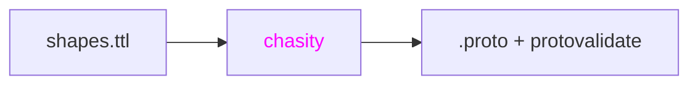

# Chasity

[SHACL](https://www.w3.org/TR/shacl/) to [Protobuf](https://protobuf.dev/)
transpiler. Takes SHACL shape graphs and generates `.proto` files with
[protovalidate](https://github.com/bufbuild/protovalidate) constraints. Built
for teams that model their domain with RDF ontologies and want type-safe gRPC
contracts.



## Install

### With Nix (recommended)

No additional dependencies needed - Nix handles everything.

Add chasity to your flake inputs:

```nix
{
  inputs.chasity.url = "github:jakubrpawlowski/chasity";
}
```

Or try it out in a shell:

```
nix shell github:jakubrpawlowski/chasity
```

### Without Nix

Download the binary from
[GitHub Releases](https://github.com/jakubrpawlowski/chasity/releases) and add
it to your PATH. You also need these on PATH:

- [Apache Jena](https://jena.apache.org/) (provides `riot`)
- [buf](https://buf.build/) (provides `buf format`)

## Usage

```
# single file
chasity generate --shapes person.ttl --out ./proto/ --package mycompany.api.v1

# directory (processes all .ttl files)
chasity generate --shapes shapes/ --out ./proto/ --package mycompany.api.v1
```

The output directory needs a `buf.yaml` for `buf lint` to work. Create one if
you don't have it:

```
echo 'version: v2' > proto/buf.yaml
```

## Architecture

Chasity follows a standard compiler pipeline:

```
.ttl  ->  riot  ->  N-Triples  ->  ntriples.ml  ->  triple store  ->  shacl.ml  ->  .proto
          ~~~~      ~~~~~~~~~      ~~~~~~~~~~~      ~~~~~~~~~~~~      ~~~~~~~~      ~~~~~~
          lexer     tokens         parser           AST               IR            codegen
```

| File                  | Compiler phase         | What it does                                                    |
| --------------------- | ---------------------- | --------------------------------------------------------------- |
| `lib/ntriples.ml`     | Lexer/Parser           | Shells out to `riot`, parses N-Triples lines into typed triples |
| `lib/triple_store.ml` | AST                    | In-memory subject-indexed store of parsed triples               |
| `lib/shacl.ml`        | Semantic analysis → IR | Extracts typed SHACL shapes from the triple store               |
| `lib/proto_emit.ml`   | Code generation        | Emits `.proto` files from shapes                                |
