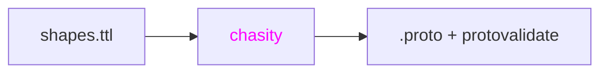

# Chasity

[SHACL](https://www.w3.org/TR/shacl/) to [Protobuf](https://protobuf.dev/)
transpiler. Takes SHACL shape graphs and generates `.proto` files with
[protovalidate](https://github.com/bufbuild/protovalidate) constraints.



## Prerequisites

- [Nix](https://nixos.org/) with flakes enabled

## Usage

```
chasity generate --shapes shapes.ttl --out ./proto/
```

Built for teams that model their domain with RDF ontologies and want type-safe
gRPC contracts.
