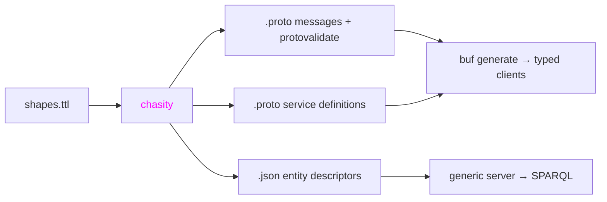

# Chasity

[SHACL](https://www.w3.org/TR/shacl/) shape compiler. Takes SHACL shape graphs
and generates [Protobuf](https://protobuf.dev/) messages with
[protovalidate](https://github.com/bufbuild/protovalidate) constraints, gRPC
service definitions, and JSON entity descriptors. Built for teams that model
their domain with RDF ontologies and want type-safe gRPC contracts backed by a
generic SPARQL-based server.



## Install

### With Nix (recommended)

No additional dependencies needed - Nix handles everything.

Add chasity to your flake inputs:

```nix
{
  inputs.chasity.url = "github:jakubrpawlowski/chasity";
}
```

Or try it out in a shell:

```
nix shell github:jakubrpawlowski/chasity
```

### Without Nix

Download the binary from
[GitHub Releases](https://github.com/jakubrpawlowski/chasity/releases) and add
it to your PATH. You also need these on PATH:

- [Apache Jena](https://jena.apache.org/) (provides `riot`)
- [buf](https://buf.build/) (provides `buf format`)

## Usage

```
# single file
chasity generate --shapes person.ttl --out ./proto/ --package mycompany.api.v1

# directory (processes all .ttl files)
chasity generate --shapes shapes/ --out ./proto/ --package mycompany.api.v1
```

For each shape file, chasity emits three outputs into the `--out` directory:

- `<entity>.proto` — messages with protovalidate constraints
- `<entity>_service.proto` — gRPC service with List, BatchGet, CRUD RPCs
- `<entity>.json` — entity descriptor for the generic server

The output directory needs a `buf.yaml` for `buf lint` to work. Create one if
you don't have it:

```yaml
# proto/buf.yaml
version: v2
deps:
  - buf.build/bufbuild/protovalidate
```

### Generated files

**`<entity>.proto`** — Protobuf message definitions. Each SHACL `NodeShape`
becomes a proto `message` with fields derived from `sh:property`. XSD datatypes
map to proto types, `sh:in` becomes `enum`, `sh:or` becomes `oneof`, and
`sh:node` references become embedded messages. SHACL validation constraints
(`sh:pattern`, `sh:minLength`, `sh:minInclusive`, etc.) are emitted as
[protovalidate](https://github.com/bufbuild/protovalidate) field options.

**`<entity>_service.proto`** — gRPC service definitions. Each entity gets a
service with `ListUris`, `BatchGet`, `Create`, `Get`, `Update`, and `Delete`
RPCs, plus the corresponding request/response wrapper messages with cursor-based
pagination.

**`<entity>.json`** — Entity descriptors that capture the RDF mapping for each
entity: predicates, XSD datatypes, field kinds, cardinality, and references.
These are read at startup by a generic server that translates gRPC calls into
SPARQL queries at runtime — no per-entity server code needed. Each field has a
`kind` that tells the server how to handle it:

| Kind           | SHACL source                       | Example                 |
| -------------- | ---------------------------------- | ----------------------- |
| `literal`      | `sh:datatype`                      | name, email, birth_date |
| `value_object` | `sh:node` + `sh:maxCount 1`        | employer                |
| `sub_entity`   | `sh:node` + repeated               | addresses               |
| `uri_ref`      | `sh:class` (no `sh:node`) singular | donor, event            |
| `repeated_uri` | `sh:class` (no `sh:node`) repeated | tags                    |
| `enum`         | `sh:in`                            | gender, status          |
| `oneof`        | `sh:or`                            | paid_with               |

## Architecture

Chasity follows a standard compiler pipeline:

```
.ttl -> riot -> N-Triples -> ntriples.ml -> triple store -> shacl.ml -> resolve -> emit
       ~~~~    ~~~~~~~~~    ~~~~~~~~~~~    ~~~~~~~~~~~~    ~~~~~~~~    ~~~~~~~    ~~~~
       lexer   tokens       parser         indexed AST     IR          linker     codegen
                                                                                  ├─ .proto messages
                                                                                  ├─ .proto services
                                                                                  └─ .json descriptors
```

| File                     | Compiler phase         | What it does                                                    |
| ------------------------ | ---------------------- | --------------------------------------------------------------- |
| `lib/ntriples.ml`        | Lexer/Parser           | Shells out to `riot`, parses N-Triples lines into typed triples |
| `lib/triple_store.ml`    | Indexed AST            | Subject-indexed store for triple lookups                        |
| `lib/shacl.ml`           | Semantic analysis → IR | Extracts typed SHACL shapes from the triple store               |
| `lib/resolve.ml`         | Linking                | Resolves cross-file shape references into proto import paths    |
| `lib/proto_emit.ml`      | Code generation        | Emits `.proto` messages from shapes                             |
| `lib/validate_emit.ml`   | Code generation        | Maps SHACL constraints to protovalidate field options           |
| `lib/service_emit.ml`    | Code generation        | Emits `.proto` gRPC service definitions                         |
| `lib/descriptor_emit.ml` | Code generation        | Emits `.json` entity descriptors                                |
| `lib/pipeline.ml`        | Orchestration          | Wires parse → extract → resolve → emit stages together          |
